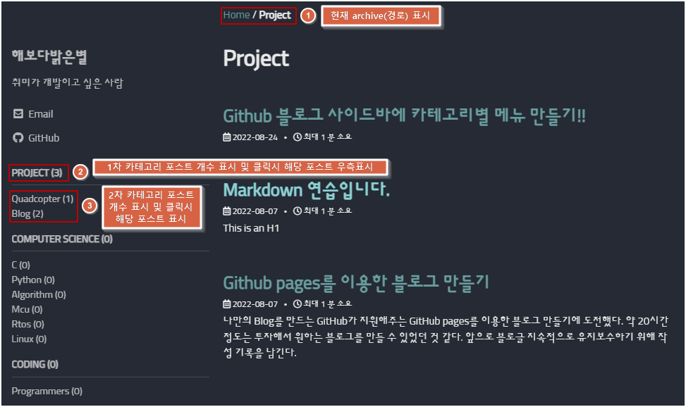

## 개요

 "Teddynote" 님의 유튜브를 보면서 GitHub pages를 이용하여 블로그를 개발하였다. "Teddynote" 님의 유튜브 링크는 아래와 같다.

- [https://www.youtube.com/c/teddynote](https://www.youtube.com/c/teddynote)
- 참고한 영상 제목
  1. 깃헙(GitHub) 블로그 10분 안에 완성하기(17분 11초)
  2. 깃헙(GitHub) 블로그 만들기 - 시즌1 (총 13개 영상- 영상당 10분 정도)
- 용어에 대한 이해
  1. **GitHub pages** : GitHub에서 지원해주는 웹서버 호스팅 기능 
  2. **Jekyill** : 정적 웹사이트 생성기로 깃허브의 공동 설립자 톰 프레스턴에 의해 구현되었음. 루비 프로그램 언어로 개발했으며 오픈 소스 MIT 허가서로 배포됨.
  3. **Minimal Mistakes** : Jekyill을 기반으로 생성한 만든 웹사이트 테마. 현재 (2022.08.24) 가장 인기 있는 Jekyill 테마로서 필자도 해당 테마를 복사하여 블로그를 꾸밈!

 하지만 결과적으로 내가 원하는 블로그의 최종 형태와는 약간 차이가 있어 구글링 및 삽질을 통해 필요한 기능을 구현하였다. 내가 원하는 것은 아래와 같았다.

- 왼쪽 사이드바에 작성한 post의 category가 계층별로 표시되고 그 옆에는 post의 개수가 표시
- 해당 category 메뉴를 클릭하면 category에 해당하는 post가 우측 메인화면에 표시
- category 별로 지정된 archive(저장소 경로)가 위쪽에 표시

## Archive(저장소) 생성

### _config.yml 파일 수정

 우리가 Windows OS에서 폴더를 생성해놓듯이 Jekyill 블로그에서도 archive를 먼저 생성해놓아야 한다. 아래와 같이 _config.yml 파일을 수정하여 필요한 archive를 먼저 등록한다. 

### breadcrumbs 옵션 활성화

 블로그 상단에 현재 경로를 보이게 하는 기능이므로 _config.yml 파일을 수정할 때 같이 활성화시켜 놓자. 초기값은 false 이므로 true로 바꿔야 한다.

- **breadcrumbs** : true

## 사이드 바 생성

### 사이드바 구조 설계

 **navigation.yml** 파일을 수정하여 화면에 보일 사이드바 내비게이션의 구조를 아래와 같이 설계한다. 필자는 사이드바를 불러올 때 사용하는 명칭을 "docs"로 하였다.

- **title** : 실제 사이드바에 표시될 category명(웹페이지에서 Click 가능한 메뉴가 된다.)

- **url** : title을 Click 하였을 때 이동할 archive

- **category_name** : 사이드바를 표시할 때 category 별 post 개수를 구하기 위해 전달하는 category의 문자열이 저장될 변수

  ※ archive와 category는 구별할 필요가 있는데,  category는 post를 작성할 때 지정한다. 즉, 각 post의 속성 중 하나라고 보면 된다. archive는 블로그의 하위 경로라고 보면 되고 각 경로마다 웹에 보이는 화면을 다르게 꾸밀 수 있다.

### 홈 화면에 사이드바 보이게 하기

**index.html** 파일을 아래와 같이 수정하여 사이트 홈 화면에 사이드바가 추가되도록 한다. 여기까지 따라왔다면 개요에서 보았던 것처럼 홈 화면 왼쪽에 사이드바가 보일 것이다.

## Archive 별 화면 layout 지정하기

 _pages 폴더에 archive별 표시될 layout 을 지정하여 웹 페이지에 표시할 수 있다. archive별로 각각 *.md 파일을 생성하여 아래와 같은 방식으로 작성한다. 

### project-archive.md 파일 작성

 "/project/ "경로를 가진 archive에 진입했을 때 불러올 layout을 설정한다. 기본적으로 index.html에서 블로그의 첫 페이지(홈 화면)를 불러오는 것과 같다. 먼저 _pages 폴더에 project-archive.md 파일을 생성한다. 그 후 layout의 다양한 속성을 설정한다. 결과적으로 사이드바에서 PROJECT 메뉴를 클릭하였을 때 project를 category 속성으로 가진 post를 화면에 보여주게 된다.

- **title** : 여기서는 큰 의미가 없다
- **layout** : jekyll에서 지원하는 layout 종류를 선택할 수 있다. category를 값으로 입력하면 category layout이 선택되고, category layout에서는 함께 설정되는 taxonomy 값(여기서는 "project")에 해당하는 모든 posts를 화면에 표시한다.
- **permalink** : 연결할 archive를 설정한다. 입력된 archive 값(여기서는 "/project/")에 해당하는 웹 화면 이동 요청을 이 파일에서 처리하게 된다. 웹 화면 이동 요청은 사이드바 구조를 설계했을 때 "url"를 입력하여 해당 메뉴를 클릭하였을 때 실행되도록 한 바 있다.
- **taxonomy** : category layout에서 표시할 post의 category 값을 전달한다.

### blog-archive.md 파일 작성

마찬가지로 project의 하위 카테고리인 blog를 category 속성으로 가진 posts 만을 보여주는 페이지를 작성한다.

## 포스트 작성 시 카테고리 값 입력

 지금까지 잘 따라왔다면, 사이드 메뉴를 클릭했을 때 해당 category별 posts가 화면에 잘 표시되어야 한다. 그렇지 않다면 포스트를 작성할 때 카테고리 값을 제대로 입력하지 않은 것이다. 여기서는 포스트를 작성할 때 카테고리 값을 계층적으로 적용하는 부분을 설명한다. 생각보다 이에 대한 정보가 않아 애를 먹었다. 이 부분이 잘 입력해야 나중에 블로그에서도 category별로 포스트를 조회할 수 있다.

위 그림처럼 포스트 작성 시 맨 위에 categories 속성을 정하게 되는 배열을 통해 여러 category를 전달할 수 있다. 여기서는 project가 1차(상위) 카테고리가 되고, blog는 2차(하위) 카테고리가 된다. 

전달되는 categories 값이 병렬구조가 아니라 계층구조라는 것은 현재 경로 표시를 통해 확인할 수 있다. 이상하게도 각 포스트를 클릭하였을 때 표시되는 현재 경로는 기본적으로 아래와 같은 값을 표시하기 때문이다. 

- Home / 1차 카테고리 / 2차 카테고리 /...n차 카테고리/post제목

실제로 categories 값 설정에 따라 아래와 같이 현재 경로가 표시된다.

※ jekyll에서 **현재 경로**를 표시할 때 2가지 방법으로 표시하는 것으로 보인다. 각 post에서는 permalink 속성을 가지지 못하기 때문일까(?)

-  archive별 layout를 지정하여 전체 포스트를 보여줄 때는 archive 경로가 표시됨
- 각 post 콘텐츠 내부 화면에서는 categori의 계층 구조가 표시됨

## 사이드바 메뉴에서 포스트 개수 표시하기

### sidebar.html

실제 사이드바를 화면에 표시하는 것은 html 문법으로 이루어져 있다.  _includes폴더에 sidebar.html 파일이 그것이다. 내용을 보면 nav_list 파일을 다시 include  한다. 

### nav_list

nav_list 파일을 보면 사이드바에 tilte 텍스트를 입력하는 곳을 찾을 수 있다. 아래 그림에서 빨간 박스 친부분 2군데 수정하면 사이드바 구조설계를 했을 때 전달했던 category_name을 활용하여 해당 category 속성을 가진 포스트의 개수를 사이드바 메뉴에 표시할 수 있게 된다.

## 마치며

블로그를 만들고 처음 작성하는 포스트라서 그런지 작업 시간이 5시간 이상 걸렸다. 원래 이렇게 오래 걸리는 것인지 궁금해 미칠 지경이다. 부디 이 포스트가 누군가에게 도움이 되길 바라본다.  앞으로 꾸준히 포스팅하여 나의 부족한 뇌 용량의 부하를 덜 수 있었으면 좋겠다. 

틀린 것이 있으면 댓글이나 메일 남겨주세요! 읽어주셔서 감사합니다. ^0^)/
